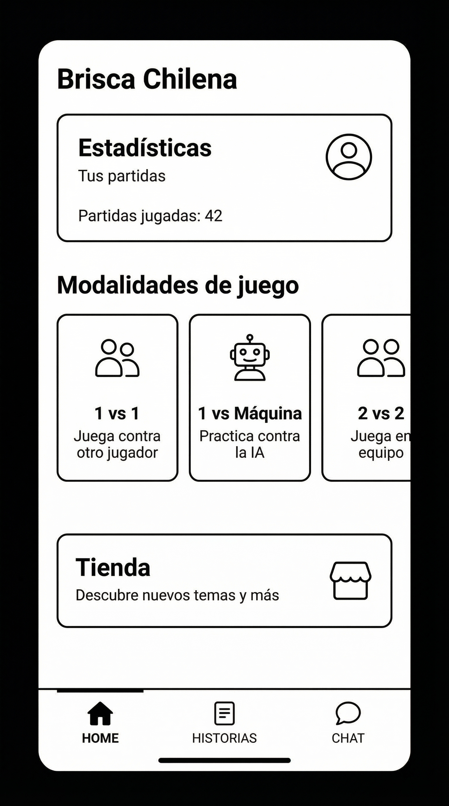

# TA-SDUI-F9 — Home Screen (clásica y SDUI)

## Navegacion
- [Volver a Epica](03-magicsdui/epica.md)
- [Volver a Backlog](03-magicsdui/backlog.md)
- [Diseno detallado](03-magicsdui/diseno-detallado.md)

## Rama
- `feat/ht-sdui-f9-home-screen`

## Objetivo
Implementar pantalla Home en dos variantes (clásica y SDUI) con card de usuario, carrusel de modalidades de juego, card de tienda y navegación inferior con tabs. La decisión entre variantes se hace mediante feature flag. Todas las navegaciones y renders se registran en log temporal (futuro Inkribbon).

## Alcance
- Pantalla Home clásica (con Dui).
- Pantalla Home SDUI (usando renderer).
- Feature flag para alternar entre ambas.
- Strings i18n para Home.
- Contrato SDUI para Home (screenId="home").
- Navegación inferior con tabs (HOME / HISTORIAS / CHAT).
- Integración con navegación Decompose.
- Registro de navegaciones y renders en log temporal (SduiInkribbonRecorder).
- Tests para validar ambas variantes.

## Wireframe/Mockup



**Diseño esperado:**
- Card de usuario en la parte superior con título "Estadísticas", subtítulo "Tus partidas" y contenido "Partidas jugadas: 42"
- Título de sección "Modalidades de juego" debajo
- Carrusel horizontal con 3 cards de modalidades:
  - "1 vs 1 - Juega contra otro jugador"
  - "1 vs Máquina - Practica contra la IA"
  - "2 vs 2 - Juega en equipo"
- Card de tienda con título "Tienda" y subtítulo "Descubre nuevos temas y más"
- Navegación inferior con 3 tabs: HOME (activa), HISTORIAS, CHAT
- Layout vertical con espaciado consistente (ThemeDimens)
- Ambos enfoques (clásico y SDUI) deben renderizar el mismo diseño visual

## 1) Interfaces y firmas (nivel 4)

### Strings i18n para Home

**Ubicación:** `features/home/presentation/strings/`

```kotlin
interface HomeStrings {
  val userStatsTitle: String
  val userStatsSubtitle: String
  val userStatsContent: String
  val gameModesTitle: String
  val gameMode1v1Title: String
  val gameMode1v1Subtitle: String
  val gameMode1v1MachineTitle: String
  val gameMode1v1MachineSubtitle: String
  val gameMode2v2Title: String
  val gameMode2v2Subtitle: String
  val storeCardTitle: String
  val storeCardSubtitle: String
  val tabHome: String
  val tabStories: String
  val tabChat: String
}

// Implementación ES
class HomeStringsEs : HomeStrings {
  override val userStatsTitle = "Estadísticas"
  override val userStatsSubtitle = "Tus partidas"
  override val userStatsContent = "Partidas jugadas: 42"
  override val gameModesTitle = "Modalidades de juego"
  override val gameMode1v1Title = "1 vs 1"
  override val gameMode1v1Subtitle = "Juega contra otro jugador"
  override val gameMode1v1MachineTitle = "1 vs Máquina"
  override val gameMode1v1MachineSubtitle = "Practica contra la IA"
  override val gameMode2v2Title = "2 vs 2"
  override val gameMode2v2Subtitle = "Juega en equipo"
  override val storeCardTitle = "Tienda"
  override val storeCardSubtitle = "Descubre nuevos temas y más"
  override val tabHome = "Inicio"
  override val tabStories = "Historias"
  override val tabChat = "Chat"
}

// Implementación EN
class HomeStringsEn : HomeStrings {
  override val userStatsTitle = "Statistics"
  override val userStatsSubtitle = "Your games"
  override val userStatsContent = "Games played: 42"
  override val gameModesTitle = "Game modes"
  override val gameMode1v1Title = "1 vs 1"
  override val gameMode1v1Subtitle = "Play against another player"
  override val gameMode1v1MachineTitle = "1 vs Machine"
  override val gameMode1v1MachineSubtitle = "Practice against AI"
  override val gameMode2v2Title = "2 vs 2"
  override val gameMode2v2Subtitle = "Play in team"
  override val storeCardTitle = "Store"
  override val storeCardSubtitle = "Discover new themes and more"
  override val tabHome = "Home"
  override val tabStories = "Stories"
  override val tabChat = "Chat"
}
```

**Regla:** Los keys i18n del contrato SDUI deben mapear a estas propiedades:
- `home_user_stats_title` → `userStatsTitle`
- `home_user_stats_subtitle` → `userStatsSubtitle`
- `home_user_stats_content` → `userStatsContent`
- `home_game_modes_title` → `gameModesTitle`
- `home_game_mode_1v1_title` → `gameMode1v1Title`
- `home_game_mode_1v1_subtitle` → `gameMode1v1Subtitle`
- `home_game_mode_1v1_machine_title` → `gameMode1v1MachineTitle`
- `home_game_mode_1v1_machine_subtitle` → `gameMode1v1MachineSubtitle`
- `home_game_mode_2v2_title` → `gameMode2v2Title`
- `home_game_mode_2v2_subtitle` → `gameMode2v2Subtitle`
- `home_store_card_title` → `storeCardTitle`
- `home_store_card_subtitle` → `storeCardSubtitle`
- `home_tab_home` → `tabHome`
- `home_tab_stories` → `tabStories`
- `home_tab_chat` → `tabChat`

### Componente Home clásico

**Ubicación:** `features/home/presentation/component/`

```kotlin
class HomeComponent(
  componentContext: ComponentContext,
  private val navigator: Navigator,
  private val strings: HomeStrings,
  private val inkribbonRecorder: SduiInkribbonRecorder
) : ComponentContext by componentContext {
  
  private val state = MutableValue(HomeState())
  val stateValue: Value<HomeState> = state
  
  fun onGameModeClick(mode: GameMode) {
    when (mode) {
      GameMode.OneVsOne -> {
        inkribbonRecorder.recordNavigation("home", "game-1v1", "classic")
        navigator.navigate("app://game-1v1")
      }
      GameMode.OneVsMachine -> {
        inkribbonRecorder.recordNavigation("home", "game-1v1-machine", "classic")
        navigator.navigate("app://game-1v1-machine")
      }
      GameMode.TwoVsTwo -> {
        inkribbonRecorder.recordNavigation("home", "game-2v2", "classic")
        navigator.navigate("app://game-2v2")
      }
    }
  }
  
  fun onStoreClick() {
    inkribbonRecorder.recordNavigation("home", "store", "classic")
    navigator.navigate("app://store")
  }
  
  fun onTabClick(tab: HomeTab) {
    when (tab) {
      HomeTab.Home -> {
        inkribbonRecorder.recordNavigation("home", "home", "classic")
        // Ya estamos en Home
      }
      HomeTab.Stories -> {
        inkribbonRecorder.recordNavigation("home", "stories", "classic")
        navigator.navigate("app://home/stories")
      }
      HomeTab.Chat -> {
        inkribbonRecorder.recordNavigation("home", "chat", "classic")
        navigator.navigate("app://home/chat")
      }
    }
  }
  
  @Composable
  fun Content() {
    HomeScreen(
      state = state.value,
      strings = strings,
      onGameModeClick = ::onGameModeClick,
      onStoreClick = ::onStoreClick,
      onTabClick = ::onTabClick
    )
    
    LaunchedEffect(Unit) {
      inkribbonRecorder.recordRender("home", "classic", true)
    }
  }
}

data class HomeState(
  val selectedTab: HomeTab = HomeTab.Home,
  val userStats: UserStats? = null
)

enum class HomeTab {
  Home, Stories, Chat
}

enum class GameMode {
  OneVsOne, OneVsMachine, TwoVsTwo
}

data class UserStats(
  val gamesPlayed: Int = 0
)
```

### Pantalla Home clásica (Compose)

**Ubicación:** `features/home/presentation/compose/`

```kotlin
@Composable
fun HomeScreen(
  state: HomeState,
  strings: HomeStrings,
  onGameModeClick: (GameMode) -> Unit,
  onStoreClick: () -> Unit,
  onTabClick: (HomeTab) -> Unit
) {
  DuiAppScaffold(
    bottomBar = {
      DuiBottomNav(
        selectedTab = state.selectedTab,
        tabs = listOf(
          HomeTab.Home to strings.tabHome,
          HomeTab.Stories to strings.tabStories,
          HomeTab.Chat to strings.tabChat
        ),
        onTabClick = onTabClick
      )
    }
  ) {
    Column(
      modifier = Modifier
        .fillMaxSize()
        .padding(ThemeDimens.NORMAL_SPACING),
      verticalArrangement = Arrangement.spacedBy(ThemeDimens.NORMAL_SPACING)
    ) {
      // Card de usuario
      DuiCard(
        title = strings.userStatsTitle,
        subtitle = strings.userStatsSubtitle
      ) {
        DuiBodyText(text = strings.userStatsContent)
      }
      
      // Título de modalidades
      DuiSubtitleText(text = strings.gameModesTitle)
      
      // Carrusel de modalidades
      DuiCarousel(
        items = listOf(
          GameMode.OneVsOne to (strings.gameMode1v1Title to strings.gameMode1v1Subtitle),
          GameMode.OneVsMachine to (strings.gameMode1v1MachineTitle to strings.gameMode1v1MachineSubtitle),
          GameMode.TwoVsTwo to (strings.gameMode2v2Title to strings.gameMode2v2Subtitle)
        )
      ) { mode, title, subtitle ->
        DuiItemCard(
          title = title,
          subtitle = subtitle,
          onClick = { onGameModeClick(mode) }
        )
      }
      
      // Card de tienda
      DuiCard(
        title = strings.storeCardTitle,
        subtitle = strings.storeCardSubtitle,
        onClick = onStoreClick
      )
    }
  }
}
```

### Feature Flag para Home SDUI

**Ubicación:** `features/home/presentation/`

```kotlin
interface HomeFlagProvider {
  fun isSduiEnabled(): Boolean
}

class HomeFlagProviderImpl(
  private val flagsRepository: FlagsRepository
) : HomeFlagProvider {
  override fun isSduiEnabled(): Boolean {
    return flagsRepository.getFlag(
      key = FlagKey("sdui_home_enabled"),
      expectedType = FlagType.Boolean,
      default = false
    ).value as? Boolean ?: false
  }
}
```

**Regla:** Inicialmente el flag será hardcodeado a `false` (pantalla clásica por defecto). Cuando exista el módulo de Flags (Epica 06), se usará `HomeFlagProvider`.

### Decisión de pantalla (clásica vs SDUI)

**Ubicación:** `features/home/presentation/component/`

```kotlin
class HomeRouterComponent(
  componentContext: ComponentContext,
  private val flagProvider: HomeFlagProvider,
  private val sduiRenderer: SduiRenderer,
  private val sduiFetchSchema: SduiFetchSchema,
  private val navigator: Navigator,
  private val strings: HomeStrings,
  private val inkribbonRecorder: SduiInkribbonRecorder,
  private val toadRecorder: SduiToadRecorder
) : ComponentContext by componentContext {
  
  @Composable
  fun Content() {
    val isSduiEnabled = flagProvider.isSduiEnabled()
    
    if (isSduiEnabled) {
      MagicsDuiRenderScreen(
        screenId = SduiScreenId("home"),
        renderer = sduiRenderer,
        fetchSchema = sduiFetchSchema,
        onAction = { action ->
          when (action.type) {
            ActionType.Navigate -> {
              inkribbonRecorder.recordNavigation("home", action.target.value, "sdui")
              navigator.navigate("app://${action.target.value}")
            }
            // ... otros tipos
          }
        },
        onRenderComplete = {
          inkribbonRecorder.recordRender("home", "sdui", true)
        },
        onRenderError = { error ->
          inkribbonRecorder.recordRender("home", "sdui", false)
          toadRecorder.recordError("home", "render", error)
        }
      )
    } else {
      HomeComponent(
        componentContext = this,
        navigator = navigator,
        strings = strings,
        inkribbonRecorder = inkribbonRecorder
      ).Content()
    }
  }
}
```

**Regla:** Si SDUI falla (fetch o parse), se hace fallback automático a Home clásico y se registra en Toad (usando `SduiToadRecorder`). Todas las navegaciones y renders se registran en Inkribbon (usando `SduiInkribbonRecorder`).

### Contrato SDUI para Home

**Estructura esperada (DTO externo):**

El contrato completo está definido en `docs/03-magicsdui/ta-f5-samples.md` (Sample: home.json). Incluye:
- `appScaffold` como raíz
- `card` para usuario y tienda
- `carousel` con 3 `itemCard` (modalidades de juego)
- `bottomNav` con 3 tabs

**Mapeo a dominio (Entity):**

El parser (TA-F2) convierte este DTO a:
- `Schema(screenId=ScreenId("home"), root=Node(...))`
- `Node` con `NodeType.Organism.AppScaffold` como raíz
- `Node` hijos con `NodeType.Molecule.Card`, `NodeType.Organism.Carousel`, `NodeType.Organism.BottomNav`

## 2) Integración con navegación Decompose

**Ubicación:** `features/home/presentation/navigation/`

```kotlin
sealed class HomeConfig {
  data class Home(val tab: HomeTab = HomeTab.Home) : HomeConfig()
  object Stories : HomeConfig()
  object Chat : HomeConfig()
}

val homeNavigation = StackNavigation<HomeConfig>()

val homeChildStack = childStack(
  source = homeNavigation,
  initialConfiguration = HomeConfig.Home(),
  handleBackButton = true
) { config, ctx ->
  when (config) {
    is HomeConfig.Home -> 
      HomeRouterComponent(
        componentContext = ctx,
        flagProvider = get(),
        sduiRenderer = get(),
        sduiFetchSchema = get(),
        navigator = homeNavigation,
        strings = get(),
        inkribbonRecorder = get(),
        toadRecorder = get()
      )
    // ... otros
  }
}
```

**Rutas:**
- `app://home` → `HomeConfig.Home(HomeTab.Home)`
- `app://home/stories` → `HomeConfig.Stories`
- `app://home/chat` → `HomeConfig.Chat`
- `app://sdui?id=home` → `HomeConfig.Home()` (si flag SDUI está habilitado, se renderiza SDUI)

## 3) Registro en log temporal (Inkribbon)

**Abstracción temporal:**

**Ubicación:** `core/sdui/presentation/recorder/`

```kotlin
interface SduiInkribbonRecorder {
  fun recordNavigation(from: String, to: String, type: String)
  fun recordRender(screenId: String, variant: String, success: Boolean)
}

class SduiInkribbonRecorderImpl : SduiInkribbonRecorder {
  override fun recordNavigation(from: String, to: String, type: String) {
    // Temporal: log a consola
    println("[Inkribbon] Navigation: $from -> $to (type: $type)")
    // Futuro: cuando exista Inkribbon, registrar evento de navegación
  }
  
  override fun recordRender(screenId: String, variant: String, success: Boolean) {
    // Temporal: log a consola
    println("[Inkribbon] Render: screenId=$screenId, variant=$variant, success=$success")
    // Futuro: cuando exista Inkribbon, registrar evento de render
  }
}
```

**Reglas de registro:**
- Todas las navegaciones se registran (clásica y SDUI).
- Todos los renders exitosos se registran (clásica y SDUI).
- Los renders fallidos también se registran (con `success=false`).

## 4) Implementacion esperada (nivel 4)

### Checklist de implementación

- [ ] Crear `HomeStrings` interface e implementaciones `HomeStringsEs` y `HomeStringsEn`.
- [ ] Crear `HomeState`, `HomeTab`, `GameMode`, `UserStats` data classes/enums.
- [ ] Crear `HomeComponent` (Decompose) con estado y handlers.
- [ ] Crear `HomeScreen` composable (clásico) usando componentes Dui.
- [ ] Crear `HomeFlagProvider` interface e implementación (hardcodeada inicialmente a `false`).
- [ ] Crear `HomeRouterComponent` que decide entre clásico y SDUI según flag.
- [ ] Implementar navegación inferior con tabs (HOME / HISTORIAS / CHAT).
- [ ] Implementar card de usuario con estadísticas.
- [ ] Implementar carrusel de modalidades de juego (1 vs máquina, 1 vs 1, 2 vs 2).
- [ ] Implementar card de tienda con CTA.
- [ ] Integrar `HomeRouterComponent` con navegación Decompose (`HomeConfig`).
- [ ] Registrar todas las navegaciones en `SduiInkribbonRecorder`.
- [ ] Registrar todos los renders (exitosos y fallidos) en `SduiInkribbonRecorder`.
- [ ] Configurar Koin para inyectar dependencias (`HomeStrings`, `HomeFlagProvider`, `HomeComponent`, `SduiInkribbonRecorder`, etc.).
- [ ] Validar que el parser (TA-F2) puede parsear el contrato Home (ver TA-F5).
- [ ] Validar que el renderer (TA-F3) puede renderizar todos los nodos del Home.
- [ ] Implementar handler de acciones SDUI (`navigate` para game modes, store, tabs).
- [ ] Implementar fallback a Home clásico si SDUI falla (fetch/parse).
- [ ] Registrar fallback en Toad usando `SduiToadRecorder`.

### Estructura de paquetes esperada

```
features/home/
├── domain/
│   ├── entity/
│   ├── valueobject/
│   ├── repository/
│   └── usecase/
├── data/
│   ├── model/
│   ├── source/
│   ├── repository/
│   └── mapper/
└── presentation/
    ├── component/
    │   ├── HomeComponent.kt
    │   └── HomeRouterComponent.kt
    ├── compose/
    │   └── HomeScreen.kt
    ├── strings/
    │   ├── HomeStrings.kt
    │   ├── HomeStringsEs.kt
    │   └── HomeStringsEn.kt
    └── navigation/
        └── HomeConfig.kt
```

## 5) Tests unitarios obligatorios

**Ubicación:** `composeApp/src/commonTest/kotlin/.../home/`

### Test: HomeFlagProvider_Default_ReturnsFalse

**Given:**
- `HomeFlagProvider` con flag hardcodeado

**Expect:**
- `isSduiEnabled()` retorna `false`

### Test: HomeFlagProvider_WhenEnabled_ReturnsTrue

**Given:**
- `HomeFlagProvider` con flag hardcodeado a `true`

**Expect:**
- `isSduiEnabled()` retorna `true`

### Test: HomeRouterComponent_WhenSduiDisabled_RendersClassic

**Given:**
- `HomeRouterComponent` con flag `false`
- Mock de `SduiRenderer` y `SduiFetchSchema`

**Expect:**
- Se renderiza `HomeComponent` (clásico)

### Test: HomeRouterComponent_WhenSduiEnabled_RendersSdui

**Given:**
- `HomeRouterComponent` con flag `true`
- Mock de `SduiRenderer` y `SduiFetchSchema`

**Expect:**
- Se llama a `MagicsDuiRenderScreen` con `screenId="home"`

### Test: HomeRouterComponent_WhenSduiFails_FallbackToClassic

**Given:**
- `HomeRouterComponent` con flag `true`
- `SduiFetchSchema` lanza excepción

**Expect:**
- Se renderiza `HomeComponent` (clásico)
- Se registra error en `SduiToadRecorder`

### Test: HomeComponent_OnGameModeClick_NavigatesCorrectly

**Given:**
- `HomeComponent` con `GameMode.OneVsOne`
- Mock de `SduiInkribbonRecorder`

**Expect:**
- Se llama a `navigator.navigate("app://game-1v1")`
- Se registra navegación en `SduiInkribbonRecorder` con `from="home"`, `to="game-1v1"`, `type="classic"`

### Test: HomeComponent_OnStoreClick_NavigatesToStore

**Given:**
- `HomeComponent`
- Mock de `SduiInkribbonRecorder`

**Expect:**
- Se llama a `navigator.navigate("app://store")`
- Se registra navegación en `SduiInkribbonRecorder` con `from="home"`, `to="store"`, `type="classic"`

### Test: HomeComponent_OnTabClick_NavigatesToTab

**Given:**
- `HomeComponent` con `HomeTab.Stories`
- Mock de `SduiInkribbonRecorder`

**Expect:**
- Se llama a `navigator.navigate("app://home/stories")`
- Se registra navegación en `SduiInkribbonRecorder` con `from="home"`, `to="stories"`, `type="classic"`

### Test: HomeComponent_OnRender_RecordsRender

**Given:**
- `HomeComponent` renderizado
- Mock de `SduiInkribbonRecorder`

**Expect:**
- Se registra render en `SduiInkribbonRecorder` con `screenId="home"`, `variant="classic"`, `success=true`

### Test: HomeStringsEs_AllKeysPresent_ReturnsSpanishTexts

**Given:**
- `HomeStringsEs()`

**Expect:**
- Todos los strings están en español y no vacíos

**Base de tests KMP:**
- **Ubicación:** `composeApp/src/commonTest/kotlin/...`
- **Framework:** `kotlin.test` + `kotlinx.coroutines.test`
- **Comando:** `./gradlew :composeApp:commonTest`
- **Dependencias requeridas en `commonTest.dependencies`:**
  - `libs.kotlin.test`
  - `libs.jetbrains.kotlinx.coroutines.test`

## 6) Pull Request (contenido esperado)

### Título
```
feat(home): home screen classic and sdui variants with navigation logging
```

### Incluye
- `HomeStrings` interface e implementaciones ES/EN.
- `HomeComponent` (Decompose) con estado y handlers.
- `HomeScreen` composable clásico (Dui) con card de usuario, carrusel, card de tienda y navegación inferior.
- `HomeFlagProvider` para alternar entre variantes.
- `HomeRouterComponent` que decide clásico vs SDUI.
- Navegación inferior con tabs (HOME / HISTORIAS / CHAT).
- Integración con navegación Decompose (`HomeConfig`).
- Registro de todas las navegaciones en `SduiInkribbonRecorder`.
- Registro de todos los renders en `SduiInkribbonRecorder`.
- Contrato SDUI para Home (JSON/DTO) - verificado contra TA-F5.
- Handler de acciones SDUI (`navigate`).
- Fallback a clásico si SDUI falla.
- Configuración Koin para inyección de dependencias.
- Tests unitarios (10 casos explícitos).

### Checklist PR
- [ ] Código compila sin errores.
- [ ] `./gradlew detekt` pasa sin errores.
- [ ] `./gradlew :composeApp:commonTest` pasa todos los tests.
- [ ] Home clásico funciona correctamente (card usuario, carrusel, card tienda, tabs).
- [ ] Home SDUI renderiza correctamente cuando flag está habilitado.
- [ ] Fallback a clásico funciona cuando SDUI falla.
- [ ] Todas las navegaciones se registran en `SduiInkribbonRecorder`.
- [ ] Todos los renders se registran en `SduiInkribbonRecorder`.
- [ ] Strings i18n están completos (ES y EN).
- [ ] Contrato SDUI para Home es válido y parseable (verificado contra TA-F5).
- [ ] Renderer puede renderizar todos los nodos del Home.

## 7) Notas de implementación

### Dependencias de otras TAs

- **TA-F0 (Domain)**: `SduiScreenId`, `Schema`, `Node`, etc. deben estar implementados.
- **TA-F1 (Contract)**: `SduiScreenDto`, `SduiNodeDto`, `SduiActionDto` deben estar definidos.
- **TA-F2 (Parser)**: `SduiContractParser` debe poder parsear el contrato Home.
- **TA-F3 (Renderer)**: `SduiRenderer` debe poder renderizar todos los tipos de nodos del Home (`appScaffold`, `card`, `carousel`, `itemCard`, `bottomNav`).
- **TA-F4 (Make)**: Target `make run-sdui-screen-home` debe abrir la pantalla Home.
- **TA-F5 (Samples)**: El contrato `home.json` debe estar completo y validado.

### Feature Flag inicial

El flag `sdui_home_enabled` será hardcodeado inicialmente:
```kotlin
class HomeFlagProviderImpl : HomeFlagProvider {
  override fun isSduiEnabled(): Boolean = false // Hardcoded inicialmente
}
```

Cuando exista el módulo de Flags (Epica 06), se actualizará para usar `FlagsRepository`.

### Validación del renderer

Esta historia técnica es crítica para validar que el renderer SDUI funciona con organismos complejos:
1. El contrato Home debe ser parseable (TA-F2).
2. Todos los nodos deben ser renderizables (TA-F3), incluyendo `carousel` y `bottomNav`.
3. Las acciones deben funcionar correctamente.
4. El fallback debe funcionar si hay errores.

### Contrato SDUI

El contrato SDUI para Home está definido completamente en `docs/03-magicsdui/ta-f5-samples.md` (Sample: home.json). Debe estar disponible en:
- Mockoon (mock server) en la ruta `/api/sdui/home` (cuando exista).
- Archivo local para pruebas: `composeApp/src/commonMain/resources/sdui/screen/home.json`.

### i18n y contrato SDUI

Los keys del contrato SDUI (`home_user_stats_title`, `home_game_modes_title`, etc.) deben mapear exactamente a las propiedades de `HomeStrings`. El renderer debe resolver estos keys usando el `StringsProvider` inyectado.

### Registro en Inkribbon

Todas las navegaciones y renders se registran usando `SduiInkribbonRecorder`. Inicialmente esta implementación solo loguea a consola. Cuando exista el módulo Inkribbon (Epica 04), se actualizará para registrar eventos reales.

### Navegación inferior

La navegación inferior (`bottomNav`) es parte del Home. Los tabs pueden tener diferentes variantes:
- Tab HOME: puede ser clásico o SDUI según flag `sdui_home_enabled`
- Tab HISTORIAS: puede ser clásico o SDUI según flag `sdui_stories_enabled` (futuro)
- Tab CHAT: siempre clásico (por ahora)

Esto permite combinaciones como Home clásico con Historias SDUI y Chat clásico.
